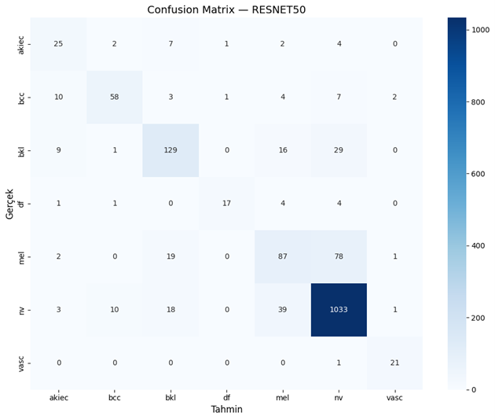
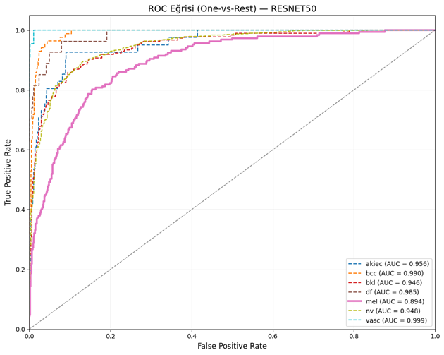

# 🔬 HAM10000 Skin Lesion Classification using Deep Learning


This repository contains a comprehensive Machine Learning and Deep Learning pipeline for classifying 7 different types of skin lesions using the **HAM10000** dermoscopic image dataset. 

Instead of solely chasing accuracy, this project tackles critical real-world AI challenges in the medical domain: **Data Leakage**, **Extreme Class Imbalance (58:1)**, and optimizing for **Melanoma Recall** (minimizing false negatives for deadly cancers).

📄 **[Read the Full Research Paper (PDF) here](./Rapor_Deri_Lezyonu_Siniflandirmasi.pdf)**

## ✨ Key Features & Methodology

* **Preventing Data Leakage:** Implemented patient-level (`lesion_id`) `StratifiedGroupKFold` cross-validation. This ensures that multiple images of the same lesion do not leak across training and test sets, avoiding artificial metric inflation.
* **Handling 58:1 Class Imbalance:** Addressed the severe bias towards Melanocytic Nevi (nv) using **SMOTE** for classical ML and **Class Weighting + Data Augmentation** for Deep Learning models.
* **Ablation Study on ResNet50:** Systematically measured the independent and combined effects of data augmentation and class weighting on the model's predictive power.
* **Clinical Safety First:** Evaluated models using Macro F1 and **Melanoma (mel) Recall**, prioritizing the detection of malignant lesions over general accuracy.

## 📊 Model Performances (Test Set)

We compared classical Machine Learning algorithms (k-NN, SVM) with Transfer Learning architectures (AlexNet, VGG16, ResNet50).

| Category | Architecture | Feature Ext. / Setup | Macro F1 | Accuracy | Melanoma (mel) Recall |
| :--- | :--- | :--- | :--- | :--- | :--- |
| **Classical ML** | k-NN | PCA + SMOTE | 0.3031 | 52.06% | 0.4064 |
| **Classical ML** | SVM | HOG + PCA | 0.2477 | 56.91% | 0.3690 |
| **Deep Learning** | AlexNet | Transfer Learning | 0.5501 | 70.91% | 0.5829 |
| **Deep Learning**| **VGG16** | Transfer Learning | 0.6257 | 76.91% | **0.5936** |
| **Deep Learning**| **ResNet50** | Transfer Learning | **0.7236** | **83.03%** | 0.4652 |

💡 **The Clinical Paradox:** While **ResNet50** achieved the highest overall Accuracy and Macro F1 score, **VGG16** outperformed it in **Melanoma Recall**. In a clinical Decision Support System, missing a cancer diagnosis (false negative) is fatal. Therefore, VGG16 proves to be a safer and more reliable architecture for this specific medical task.

## 📈 Visual Analysis

*(Note: Ensure you place your images in the `images/` folder for these to display correctly)*

### ResNet50 Confusion Matrix


### ROC Curves (One-vs-Rest)


## 📁 Repository Structure

```text
HAM10000-Skin-Lesion-Classification/
│
├── dataset/                  # Ensure dataset zip is extracted here
│   └── .keep
├── images/                   # Contains plots for README
├── src/                      # Source code
│   ├── 0.0_kurulum_veri_indirme.py
│   ├── 0.5_klasor_duzenleme.py
│   ├── 1_veri_bolme.py
│   ├── 2_baseline_klasik_ml.py
│   ├── 3_transfer_ogrenme.py
│   ├── 4_degerlendirme_ablasyon.py
│   └── 5_modelleri_kaydetme.py
├── requirements.txt
├── README.md
├── .gitignore
└── Rapor_Deri_Lezyonu_Siniflandirmasi.pdf
```

## 💻 Installation & Usage

1. Clone the repository:
    ```Bash

    git clone https://github.com/YOUR_USERNAME/HAM10000-Skin-Lesion-Classification.git
    cd HAM10000-Skin-Lesion-Classification
    ```

2. Install dependencies:
    ```Bash

    pip install -r requirements.txt
    ```

3. Download the Dataset:
    Download the HAM10000 dataset (e.g., from Harvard Dataverse or Kaggle) and place the HAM10000.zip file in the root directory.

4. Run the pipeline:
    Execute the scripts in the src/ directory in numerical order from 0.0 to 5.

📜 License

This project is licensed under the MIT License - see the LICENSE file for details.
